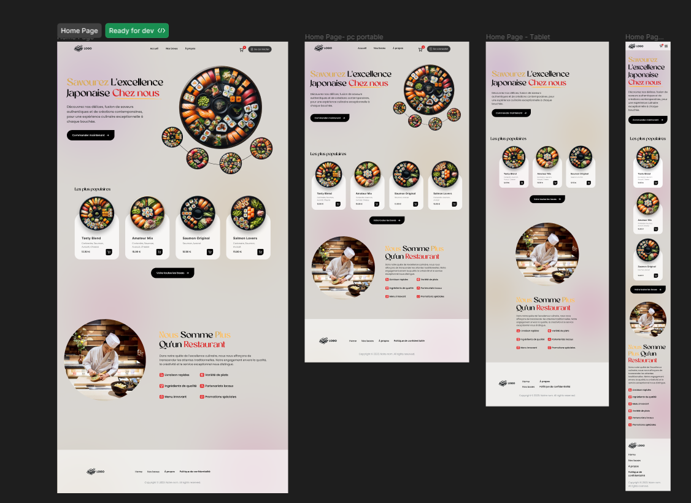
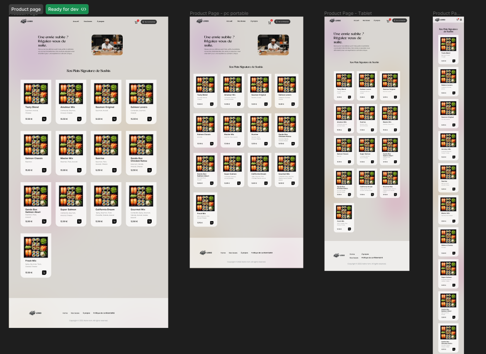
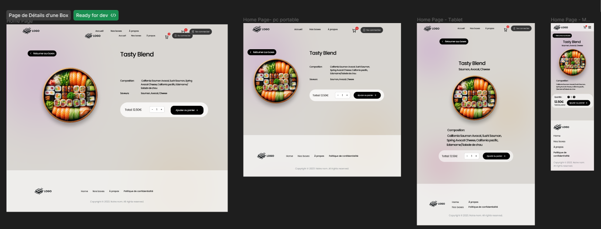
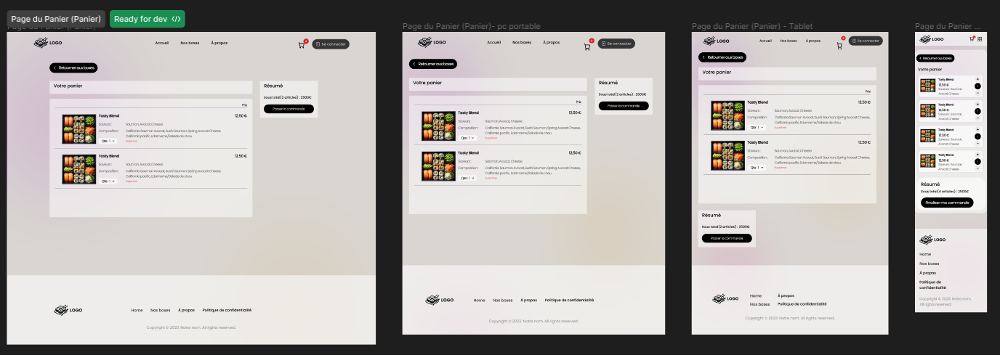
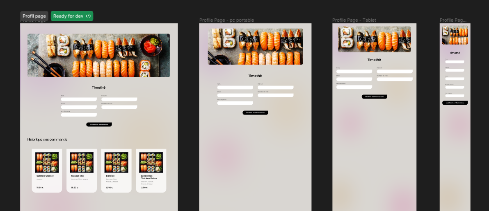

# Projet : SAE-401

## Informations générales

- **Date** : 13 février 2024
- **Équipe** : Nolan Dalle-Molle, Rémy Hamelin, Nicolas Marly, Timothé Hege
- **Nom du projet** : Hako Shi

## Ressources

- **Dépôt distant** : [GitHub](https://github.com/RETR0EDIT/SAE-401.git)
- **Gestion de projet** : [Trello](https://trello.com/b/DEcimwUf/sae401)
- **Maquette** : [Figma](https://www.figma.com/file/T09ITGulXjBEqKCvg3gFOV/SAE-401?type=design&node-id=0-1&mode=design&t=X9FG0fqKFIAcFnWK-0)

## Logo

## Diagrammes

- [Visualiser le diagramme de classe](liverable/diagramme_de_classe/Diagramme_de_classe.pdf)
- [Visualiser le use case](liverable/use_case/Use_case.pdf)

## Maquettes

### Home page

### Product page

### Page details

### Panier

### Profil page

